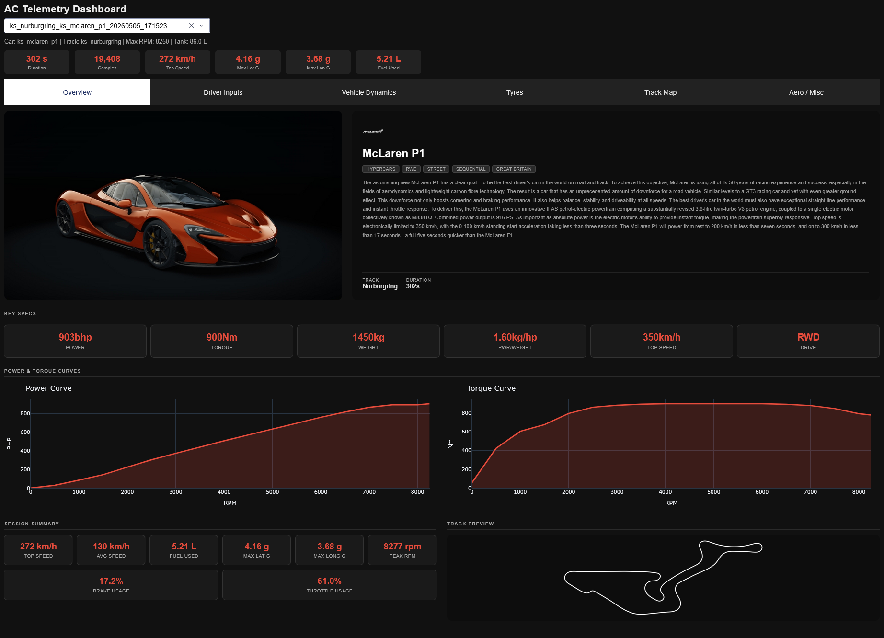
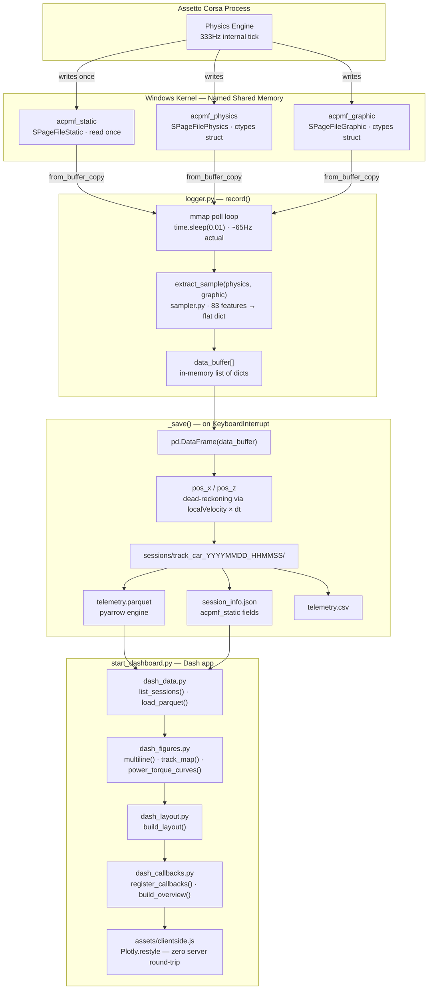
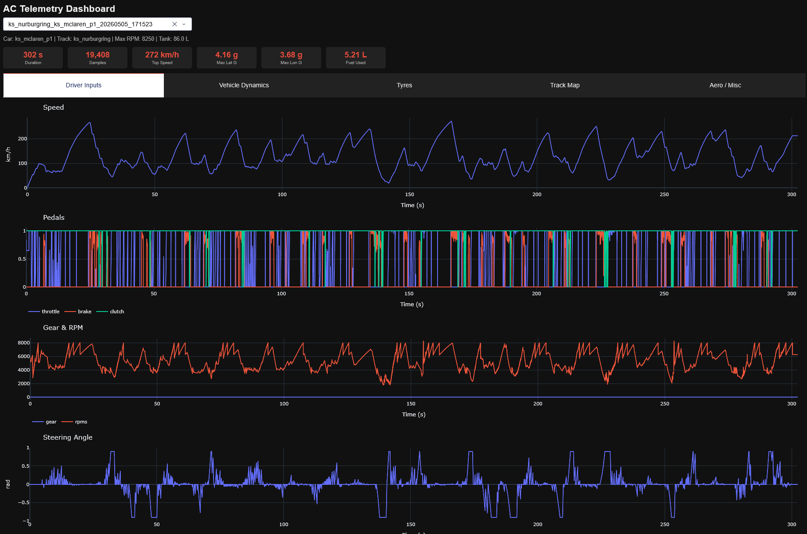
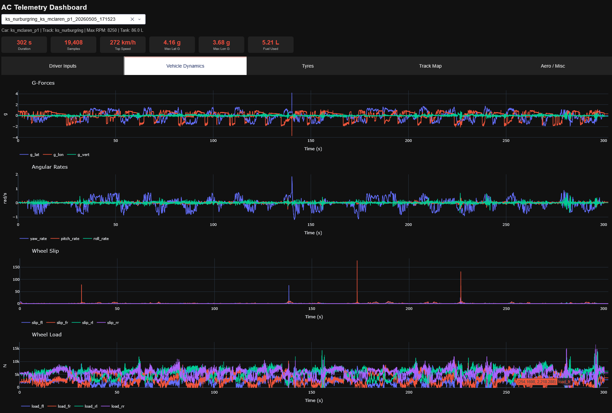
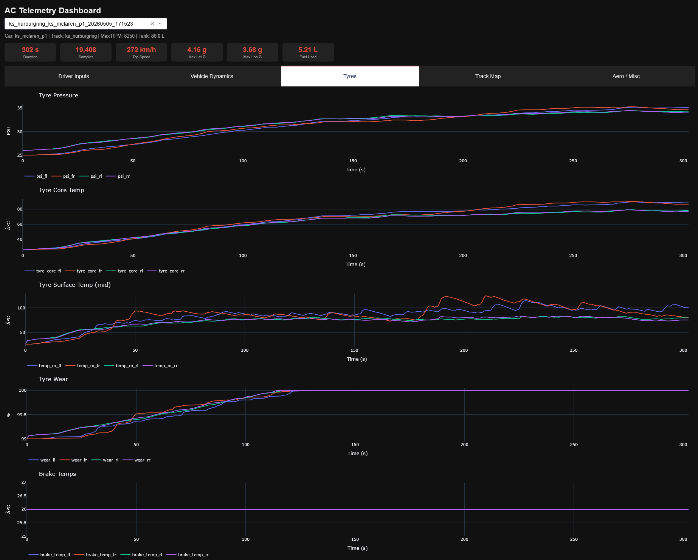
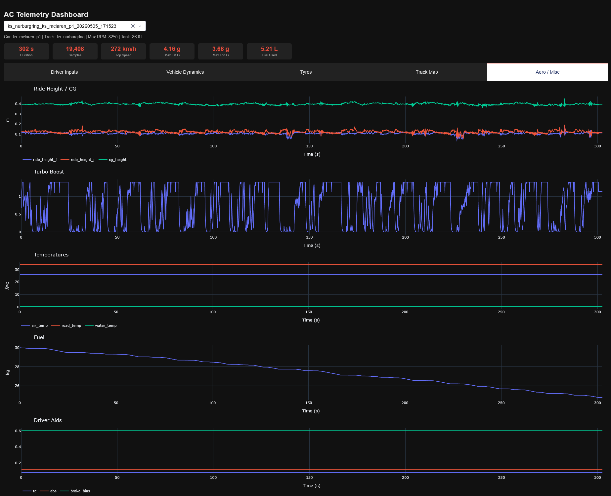
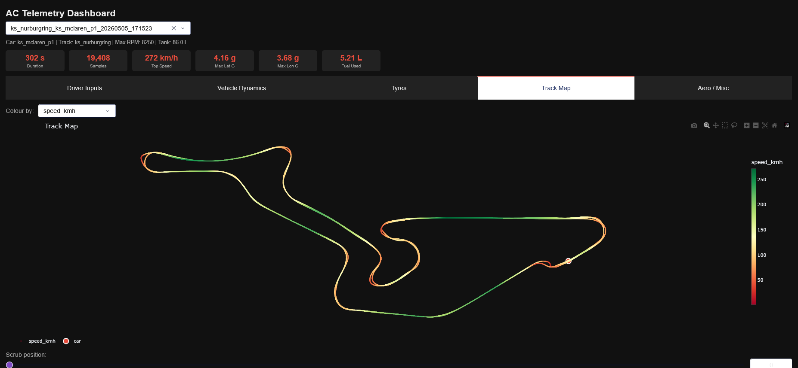

<h1 align="center">AC-Datalogger</h1>

<p align="center">
  High-frequency telemetry acquisition for Assetto Corsa via direct Windows shared memory mapping.<br>
  Structured session output targeting Parquet/CSV pipelines and ML feature extraction.
</p>

<p align="center">
  
</p>

---

## How it works

Assetto Corsa exposes three named shared memory pages (`acpmf_physics`, `acpmf_graphic`, `acpmf_static`) via the Windows kernel object namespace. This tool maps those pages directly using `mmap` + `ctypes` structs, bypassing any plugin or SDK layer entirely. The poll loop runs at ~65Hz (target 100Hz, capped by Windows default timer resolution of ~15.6ms), and on `KeyboardInterrupt` flushes the in-memory buffer to a named session directory as Parquet, CSV, and a JSON metadata sidecar.

No plugins, no modding, no game modification required — just run the script while AC is open.



---

## Requirements

- Windows — shared memory namespace is Win32-only (`CreateFileMapping` / `OpenFileMapping`)
- Assetto Corsa with **Shared Memory enabled** (`Settings → General → Enable Shared Memory`)
- Python 3.8+

```
pip install -r requirements.txt
```

---

## Usage

```bash
# acquire a session
python main.py

# serve the analysis dashboard
python start_dashboard.py
```

The logger blocks on the poll loop until `Ctrl+C`. All I/O happens in `_save()` after the interrupt — no partial writes during acquisition.

```
Connecting to Assetto Corsa...
Connected! Waiting for you to hit the track...
Press Ctrl+C to stop recording and save the data.

Recording stopped. Processing 7568 data points...
Saved 7568 rows to sessions/monza_ferrari_458_gt2_20260504_144401
```

---

## Project structure

```
ac-datalogger/
  main.py               # entry point — loads config.yaml, calls record()
  start_dashboard.py    # entry point — Dash app init, Flask /metadata route
  config.yaml           # logger parameters
  dashboard.yaml        # dashboard server, theme, tab/plot definitions
  requirements.txt      # pinned dependencies
  assets/
    clientside.js       # browser-side Plotly.restyle for scrubber marker
    dashboard.css       # Dash component style overrides
  metadata/
    {car_id}/
      {car_id}.jpg      # car render image
      {brand}.png       # brand logo
      specs.json        # name, description, tags, specs, power/torque curves
    track/
      {track_id}.png    # track layout image
  src/
    shared_memory.py    # ctypes structs — SPageFilePhysics, SPageFileGraphic, SPageFileStatic
    sampler.py          # extract_sample() — struct fields → 83-feature flat dict
    logger.py           # record() poll loop + _save() flush
    dash_data.py        # list_sessions(), load_parquet()
    dash_figures.py     # multiline(), track_map(), power_torque_curves()
    dash_layout.py      # build_layout() — Dash component tree
    dash_callbacks.py   # register_callbacks(), build_overview()
  sessions/
    {track}_{car}_{YYYYMMDD_HHMMSS}/
      session_info.json
      telemetry.parquet
      telemetry.csv
```

---

## Dashboard

```bash
python start_dashboard.py
# → http://127.0.0.1:8050
```

Select a session from the dropdown. Six tabs expose the full feature set:

| Tab | Contents |
|---|---|
| Overview | Hero header, key specs, power & torque curves, session KPIs, track preview |
| Driver Inputs | Speed, pedals, gear & RPM, steering angle |
| Vehicle Dynamics | G-forces, angular rates, wheel slip, wheel load |
| Tyres | Pressure, core temp, surface temp, wear, brake temps |
| Aero / Misc | Ride height, turbo boost, environment temps, fuel, driver aids |
| Track Map | `pos_x`/`pos_z` scatter coloured by any channel, position scrubber |

### Overview

Built entirely from session telemetry and `metadata/` — no additional configuration required.

| Section | Contents |
|---|---|
| Hero | Car render, brand logo, name, class/tag badges, description, track, session duration |
| Key Specs | Power, torque, weight, power-to-weight ratio, top speed, drive type |
| Power & Torque Curves | Interactive BHP and Nm vs RPM from `specs.json` |
| Session Summary | Top speed, avg speed, fuel used, max lat G, max long G, peak RPM, brake %, throttle % |
| Track Preview | Layout image from `metadata/track/` |

### Driver Inputs

<p align="center">
  
</p>

Speed, throttle/brake/clutch pedal traces, gear & RPM, and steering angle — all plotted against elapsed time.

### Vehicle Dynamics

<p align="center">
  
</p>

Lateral/longitudinal/vertical G-forces, yaw/pitch/roll rates from `localAngularVel`, per-corner wheel slip ratios, and wheel load in Newtons.

### Tyres

<p align="center">
  
</p>

Per-corner tyre pressure (PSI), core temperature, surface temperature (inner/mid/outer zones), wear percentage, and brake disc temperatures.

### Aero / Misc

<p align="center">
  
</p>

Front/rear ride height and CG height, turbo boost pressure, ambient/road/water temperatures, fuel load, and driver aid states (TC, ABS, brake bias).

### Track Map

<p align="center">
  
</p>

Full lap trace rendered as a `pos_x`/`pos_z` scatter, coloured by a selectable channel (speed, throttle, brake, lateral G, longitudinal G). The scrub slider drives a car marker via `Plotly.restyle` in `assets/clientside.js` — zero server round-trips, pure browser execution.

---

## Configuration

### `config.yaml`

```yaml
recording:
  speed_threshold_kmh: 1.0   # discard samples below this speed — filters pit lane idle
  sample_interval_sec: 0.01  # target ~100Hz; actual ~65Hz due to Windows 15.6ms timer floor

output:
  sessions_dir: sessions      # resolved relative to project root in main.py
  save_parquet: true
  save_csv: true

shared_memory:
  physics_map: "Local\\acpmf_physics"
  graphic_map: "Local\\acpmf_graphic"
  static_map:  "Local\\acpmf_static"
```

### `dashboard.yaml`

```yaml
server:
  host: "127.0.0.1"
  port: 8050
  debug: false

theme:
  background: "#111111"
  surface:    "#222222"
  text:       "#eeeeee"
  muted:      "#aaaaaa"
  accent:     "#e74c3c"
  plot_template: "plotly_dark"

charts:
  height: 280
  margin: {l: 40, r: 20, t: 40, b: 40}

tabs:
  - id: overview
    label: "Overview"
    type: overview

  - id: inputs
    label: "Driver Inputs"
    plots:
      - { id: speed, title: "Speed", y_label: "km/h", cols: [speed_kmh] }
      # ...

  - id: map
    label: "Track Map"
    type: map
    color_channels: [speed_kmh, throttle, brake, g_lat, g_lon]
```

Adding a new chart requires only a new entry under `plots:` — no Python changes needed.

### `metadata/specs.json` schema

```json
{
  "name": "Nissan GT-R GT3",
  "brand": "Nissan",
  "description": "Long-form car description text.",
  "tags": ["#GTE-GT3", "rwd", "race", "sequential"],
  "class": "race",
  "specs": {
    "bhp": "600bhp",
    "torque": "700Nm",
    "weight": "1300kg",
    "topspeed": "280+km/h",
    "pwratio": "2.17kg/hp"
  },
  "powerCurve":  [["0", "0"], ["1000", "21"], ["7500", "553"]],
  "torqueCurve": [["0", "0"], ["1000", "149"], ["7500", "525"]]
}
```

Track layout images: `metadata/track/{track_id}.png`. Served to the browser via the Flask route `/metadata/<path>` registered in `start_dashboard.py`.

---

## Captured features (83 total)

| Group | Features |
|---|---|
| Core | `speed_kmh`, `rpms`, `gear` |
| Driver inputs | `throttle`, `brake`, `clutch`, `steer_angle` |
| G-forces | `g_lat`, `g_vert`, `g_lon` |
| Local velocity | `vel_x`, `vel_y`, `vel_z` |
| Vehicle dynamics | `slip_angle`, `yaw_rate`, `pitch_rate`, `roll_rate` |
| Orientation | `heading`, `pitch`, `roll` |
| Suspension travel | `susp_fl/fr/rl/rr` |
| Wheel load (N) | `load_fl/fr/rl/rr` |
| Wheel slip | `slip_fl/fr/rl/rr` |
| Tyre pressure (PSI) | `psi_fl/fr/rl/rr` |
| Tyre core temp | `tyre_core_fl/fr/rl/rr` |
| Tyre surface temp | `temp_i/m/o_fl/fr/rl/rr` (inner, middle, outer) |
| Tyre wear | `wear_fl/fr/rl/rr` |
| Brake temps | `brake_temp_fl/fr/rl/rr` |
| Wheel angular speed | `wheel_speed_fl/fr/rl/rr` |
| Camber | `camber_fl/fr/rl/rr` |
| Aero / chassis | `ride_height_f/r`, `cg_height`, `turbo_boost`, `drs` |
| Driver aids | `tc`, `abs`, `brake_bias` |
| Environment | `air_temp`, `road_temp`, `water_temp`, `fuel` |
| Track position | `lap_progress`, `pos_x`, `pos_z` |

`pos_x` and `pos_z` are dead-reckoned in `_save()` by integrating `localVelocity` rotated by `heading` over the per-sample `dt` — they are not read from shared memory directly.

---

## Sample rate

`time.sleep(0.01)` targets 100Hz. Windows default timer resolution is ~15.6ms, capping actual throughput to ~65Hz with non-uniform intervals. `timeBeginPeriod(1)` would raise resolution to 1ms system-wide but is a process-global side effect that degrades power management across all running processes — not an acceptable tradeoff for a logging tool.

For analysis requiring uniform time steps, resample in post-processing:

```python
import pandas as pd

df = pd.read_parquet("sessions/track_car_YYYYMMDD_HHMMSS/telemetry.parquet")
df = df.set_index("timestamp")
df.index = pd.to_datetime(df.index, unit="s")
df = df.resample("10ms").interpolate()  # uniform 100Hz grid
```

---

## Session metadata

`acpmf_static` is read once at session start via `SPageFileStatic.from_buffer_copy()` and written to `session_info.json`:

```json
{
  "car": "ferrari_458_gt2",
  "track": "monza",
  "track_configuration": "gp",
  "max_rpm": 9000,
  "max_power_w": 373000.0,
  "max_torque_nm": 440.0,
  "max_fuel_kg": 120.0
}
```

---

## Shared memory reference

| Page | Named object | Struct | Usage |
|---|---|---|---|
| Physics | `Local\acpmf_physics` | `SPageFilePhysics` | Polled every tick — all real-time car physics |
| Graphics | `Local\acpmf_graphic` | `SPageFileGraphic` | Polled every tick — session state, lap progress |
| Static | `Local\acpmf_static` | `SPageFileStatic` | Read once at session start — car/track metadata |

All structs use `_pack_ = 4` to match AC's memory layout exactly. Field order and types must not be modified without cross-referencing the AC SDK headers.
