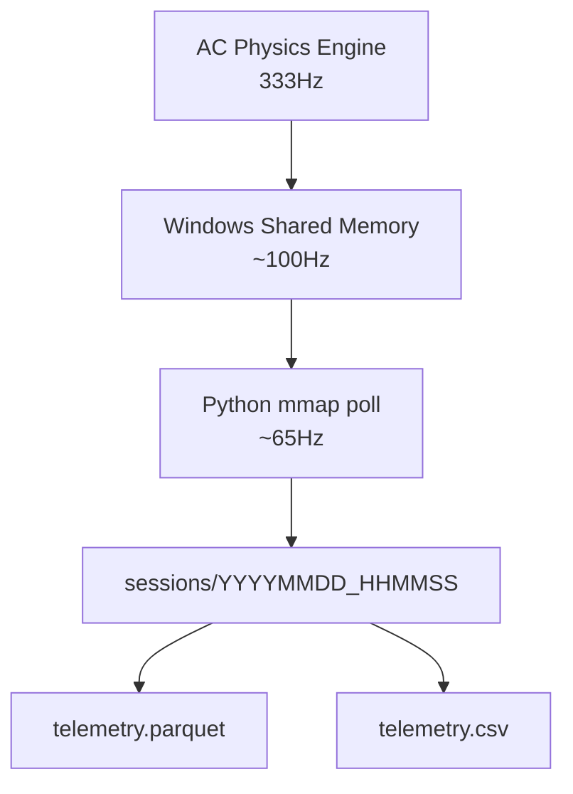

# AC-Datalogger

A high-frequency telemetry logger for Assetto Corsa that reads directly from the game's Windows shared memory interface and stores structured session data for analysis and ML pipelines.

## How it works

Assetto Corsa exposes live physics data via Windows shared memory (`acpmf_physics`, `acpmf_graphic`). This tool maps those memory blocks using `mmap` + `ctypes`, polls them at ~65Hz, and writes every sample to a timestamped session folder as both Parquet and CSV.

No plugins, no modding, no game modification required — just run the script while AC is open.



## Requirements

- Windows (shared memory is Windows-only)
- Assetto Corsa with **Shared Memory enabled** (`Settings → General → Enable Shared Memory`)
- Python 3.8+

```
pip install pandas pyarrow pyyaml
```

## Usage

```bash
python main.py
```

Drive your laps, then hit `Ctrl+C` to stop. Data is saved automatically.

```
Connected! Waiting for you to hit the track...
Press Ctrl+C to stop recording and save the data.

Recording stopped. Processing 7568 data points...
Saved 7568 rows to sessions/20260504_144401
```

## Project structure

```
ac-datalogger/
  main.py               # entry point
  config.yaml           # all tuneable settings
  src/
    shared_memory.py    # ctypes structs for acpmf_physics and acpmf_graphic
    sampler.py          # extract_sample() — maps struct fields to a flat dict
    logger.py           # record loop and session save logic
  sessions/
    YYYYMMDD_HHMMSS/
      telemetry.parquet
      telemetry.csv
```

## Configuration

All settings live in `config.yaml` — no need to touch source code for common changes.

```yaml
recording:
  speed_threshold_kmh: 1.0   # ignore samples below this speed (filters pit lane idle)
  sample_interval_sec: 0.01  # target ~100Hz (actual ~65Hz due to Windows timer resolution)

output:
  sessions_dir: sessions
  save_parquet: true
  save_csv: true

shared_memory:
  physics_map: "Local\\acpmf_physics"
  graphic_map: "Local\\acpmf_graphic"
```

## Captured features (83 total)

| Group | Features |
|---|---|
| Core | `speed_kmh`, `rpms`, `gear` |
| Driver inputs | `throttle`, `brake`, `clutch`, `steer_angle` |
| G-forces | `g_lat`, `g_vert`, `g_lon` |
| Local velocity | `vel_x`, `vel_y`, `vel_z` |
| Vehicle dynamics | `slip_angle`, `yaw_rate`, `pitch_rate`, `roll_rate` |
| Orientation | `heading`, `pitch`, `roll` |
| Suspension travel | `susp_fl/fr/rl/rr` |
| Wheel load (N) | `load_fl/fr/rl/rr` |
| Wheel slip | `slip_fl/fr/rl/rr` |
| Tyre pressure (PSI) | `psi_fl/fr/rl/rr` |
| Tyre core temp | `tyre_core_fl/fr/rl/rr` |
| Tyre surface temp | `temp_i/m/o_fl/fr/rl/rr` (inner, middle, outer) |
| Tyre wear | `wear_fl/fr/rl/rr` |
| Brake temps | `brake_temp_fl/fr/rl/rr` |
| Wheel angular speed | `wheel_speed_fl/fr/rl/rr` |
| Camber | `camber_fl/fr/rl/rr` |
| Aero / chassis | `ride_height_f/r`, `cg_height`, `turbo_boost`, `drs` |
| Driver aids | `tc`, `abs`, `brake_bias` |
| Environment | `air_temp`, `road_temp`, `water_temp`, `fuel` |

## Notes on sample rate

`time.sleep(0.01)` targets 100Hz but Windows timer resolution caps real throughput at ~65Hz. This is intentional — applying the `timeBeginPeriod(1)` fix is a system-wide change that affects all processes and isn't worth the tradeoff for telemetry logging.

If uniform time steps are needed for analysis, resample in post:

```python
import pandas as pd

df = pd.read_parquet("sessions/YYYYMMDD_HHMMSS/telemetry.parquet")
df = df.set_index("timestamp")
df.index = pd.to_datetime(df.index, unit="s")
df = df.resample("10ms").interpolate()  # uniform 100Hz
```

## Shared memory reference

AC exposes three shared memory pages. This tool uses two:

| Page | Name | Contents |
|---|---|---|
| Physics | `acpmf_physics` | All real-time car physics data |
| Graphics | `acpmf_graphic` | Session state, lap times, position |
| Static | `acpmf_static` | Car/track metadata (not used) |

Full struct documentation: [AC Shared Memory reference](https://www.assettocorsa.net/forum/index.php?threads/shared-memory-reference-documentation.58465/)
