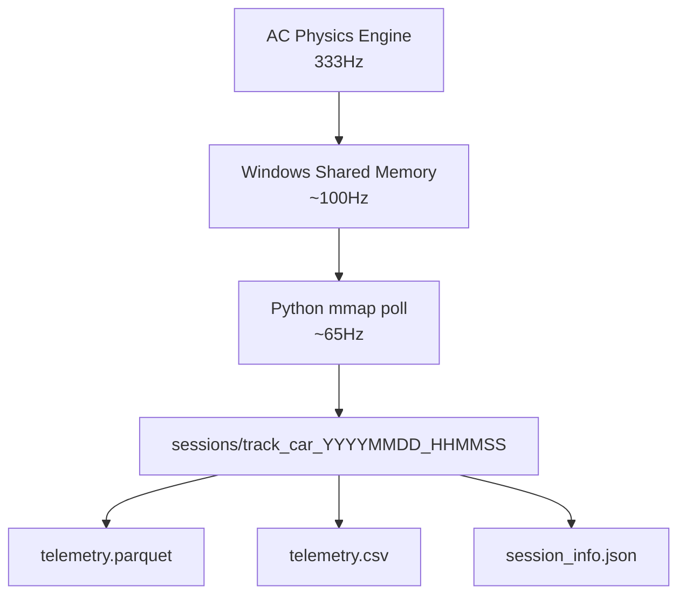

# AC-Datalogger

A high-frequency telemetry logger for Assetto Corsa that reads directly from the game's Windows shared memory interface and stores structured session data for analysis and ML pipelines.

## How it works

Assetto Corsa exposes live physics data via Windows shared memory (`acpmf_physics`, `acpmf_graphic`, `acpmf_static`). This tool maps those memory blocks using `mmap` + `ctypes`, polls them at ~65Hz, and writes every sample to a named session folder as Parquet, CSV, and a JSON metadata file.

No plugins, no modding, no game modification required — just run the script while AC is open.



## Requirements

- Windows (shared memory is Windows-only)
- Assetto Corsa with **Shared Memory enabled** (`Settings → General → Enable Shared Memory`)
- Python 3.8+

```
pip install pandas pyarrow pyyaml          # logger
pip install dash plotly                    # dashboard
```

## Usage

```bash
# record a session
python main.py

# view recorded sessions
python start_dashboard.py
```

Drive your laps, then hit `Ctrl+C` to stop. Data is saved automatically.

```
Connected! Waiting for you to hit the track...
Press Ctrl+C to stop recording and save the data.

Recording stopped. Processing 7568 data points...
Saved 7568 rows to sessions/monza_ferrari_458_gt2_20260504_144401
```

## Project structure

```
ac-datalogger/
  main.py               # logger entry point
  start_dashboard.py    # dashboard entry point
  config.yaml           # logger settings
  dashboard.yaml        # dashboard settings
  assets/
    clientside.js       # browser-side Plotly marker update
  metadata/
    {car_id}/
      {car_id}.jpg      # car render image
      {brand}.png       # brand logo
      specs.json        # car name, description, tags, specs, power/torque curves
    track/
      {track_id}.png    # track layout image
  src/
    shared_memory.py    # ctypes structs for acpmf_physics, acpmf_graphic, acpmf_static
    sampler.py          # extract_sample() — maps struct fields to a flat dict
    logger.py           # record loop and session save logic
    dash_data.py        # session listing and parquet loading
    dash_figures.py     # multiline(), track_map(), power_torque_curves() figure factories
    dash_layout.py      # Dash layout builder
    dash_callbacks.py   # all server and clientside callbacks, including build_overview()
  sessions/
    track_car_YYYYMMDD_HHMMSS/
      session_info.json
      telemetry.parquet
      telemetry.csv
```

## Dashboard

```
pip install dash plotly
python start_dashboard.py
```

Open `http://127.0.0.1:8050`. Select a session from the dropdown and explore across six tabs:

| Tab | Contents |
|---|---|
| Overview | Hero header, key specs, power & torque curves, session KPIs, track preview |
| Driver Inputs | Speed, pedals, gear & RPM, steering angle |
| Vehicle Dynamics | G-forces, angular rates, wheel slip, wheel load |
| Tyres | Pressure, core temp, surface temp, wear, brake temps |
| Aero / Misc | Ride height, turbo boost, environment temps, fuel, driver aids |
| Track Map | `pos_x`/`pos_z` scatter coloured by any channel, with a position scrubber |

### Overview tab

The Overview tab is the default landing page for each session. It is built entirely from session telemetry and the `metadata/` folder — no extra configuration needed.

| Section | Contents |
|---|---|
| Hero | Car render image, brand logo, car name, class/tag badges, description, track name, session duration |
| Key Specs | Power, torque, weight, power-to-weight ratio, top speed, drive type |
| Power & Torque Curves | Interactive BHP and Nm vs RPM charts from `specs.json` |
| Session Summary | Top speed, avg speed, fuel used, max lat G, max long G, peak RPM, brake usage %, throttle usage % |
| Track Preview | Track layout image from `metadata/track/` |

The Track Map tab renders the full lap trace coloured by a selectable channel (speed, throttle, brake, lateral G, longitudinal G). A scrub slider moves the car marker along the trace in real-time — the marker update runs entirely in the browser via `Plotly.restyle`, with no server round-trip.

All dashboard settings live in `dashboard.yaml` — server host/port, theme colours, chart dimensions, and the full tab/plot definitions. Adding a new chart or colour channel requires only a YAML edit.

## Configuration

Logger settings live in `config.yaml`. Dashboard settings live in `dashboard.yaml`.

`config.yaml`:

```yaml
recording:
  speed_threshold_kmh: 1.0   # ignore samples below this speed (filters pit lane idle)
  sample_interval_sec: 0.01  # target ~100Hz (actual ~65Hz due to Windows timer resolution)

output:
  sessions_dir: sessions
  save_parquet: true
  save_csv: true

shared_memory:
  physics_map: "Local\\acpmf_physics"
  graphic_map: "Local\\acpmf_graphic"
  static_map:  "Local\\acpmf_static"
```

`dashboard.yaml`:

```yaml
server:
  host: "127.0.0.1"
  port: 8050
  debug: false

theme:
  background: "#111111"
  accent:     "#e74c3c"
  plot_template: "plotly_dark"

charts:
  height: 280

tabs:
  - id: overview
    label: "Overview"
    type: overview

  - id: inputs
    label: "Driver Inputs"
    plots:
      - { id: speed, title: "Speed", y_label: "km/h", cols: [speed_kmh] }
      # ...

  - id: map
    label: "Track Map"
    type: map
    color_channels: [speed_kmh, throttle, brake, g_lat, g_lon]
```

### metadata/specs.json schema

Each car under `metadata/{car_id}/specs.json` should follow this structure:

```json
{
  "name": "Nissan GT-R GT3",
  "brand": "Nissan",
  "description": "Long-form car description text.",
  "tags": ["#GTE-GT3", "rwd", "race", "sequential"],
  "class": "race",
  "specs": {
    "bhp": "600bhp",
    "torque": "700Nm",
    "weight": "1300kg",
    "topspeed": "280+km/h",
    "pwratio": "2.17kg/hp"
  },
  "powerCurve":  [["0", "0"], ["1000", "21"], ["7500", "553"]],
  "torqueCurve": [["0", "0"], ["1000", "149"], ["7500", "525"]]
}
```

Track preview images live at `metadata/track/{track_id}.png`. The Flask route `/metadata/<path>` serves all assets in this folder to the browser.

## Captured features (83 total)

| Group | Features |
|---|---|
| Core | `speed_kmh`, `rpms`, `gear` |
| Driver inputs | `throttle`, `brake`, `clutch`, `steer_angle` |
| G-forces | `g_lat`, `g_vert`, `g_lon` |
| Local velocity | `vel_x`, `vel_y`, `vel_z` |
| Vehicle dynamics | `slip_angle`, `yaw_rate`, `pitch_rate`, `roll_rate` |
| Orientation | `heading`, `pitch`, `roll` |
| Suspension travel | `susp_fl/fr/rl/rr` |
| Wheel load (N) | `load_fl/fr/rl/rr` |
| Wheel slip | `slip_fl/fr/rl/rr` |
| Tyre pressure (PSI) | `psi_fl/fr/rl/rr` |
| Tyre core temp | `tyre_core_fl/fr/rl/rr` |
| Tyre surface temp | `temp_i/m/o_fl/fr/rl/rr` (inner, middle, outer) |
| Tyre wear | `wear_fl/fr/rl/rr` |
| Brake temps | `brake_temp_fl/fr/rl/rr` |
| Wheel angular speed | `wheel_speed_fl/fr/rl/rr` |
| Camber | `camber_fl/fr/rl/rr` |
| Aero / chassis | `ride_height_f/r`, `cg_height`, `turbo_boost`, `drs` |
| Driver aids | `tc`, `abs`, `brake_bias` |
| Environment | `air_temp`, `road_temp`, `water_temp`, `fuel` |

## Notes on sample rate

`time.sleep(0.01)` targets 100Hz but Windows timer resolution caps real throughput at ~65Hz. This is intentional — applying the `timeBeginPeriod(1)` fix is a system-wide change that affects all processes and isn't worth the tradeoff for telemetry logging.

If uniform time steps are needed for analysis, resample in post:

```python
import pandas as pd

df = pd.read_parquet("sessions/YYYYMMDD_HHMMSS/telemetry.parquet")
df = df.set_index("timestamp")
df.index = pd.to_datetime(df.index, unit="s")
df = df.resample("10ms").interpolate()  # uniform 100Hz
```

## Session metadata

At the start of each session, `acpmf_static` is read once and saved as `session_info.json`:

```json
{
  "car": "ferrari_458_gt2",
  "track": "monza",
  "track_configuration": "gp",
  "max_rpm": 9000,
  "max_power_w": 373000.0,
  "max_torque_nm": 440.0,
  "max_fuel_kg": 120.0
}
```

## Shared memory reference

AC exposes three shared memory pages. This tool uses two:

| Page | Name | Contents |
|---|---|---|
| Physics | `acpmf_physics` | All real-time car physics data |
| Graphics | `acpmf_graphic` | Session state, lap times, position |
| Static | `acpmf_static` | Car/track metadata — read once at session start |


